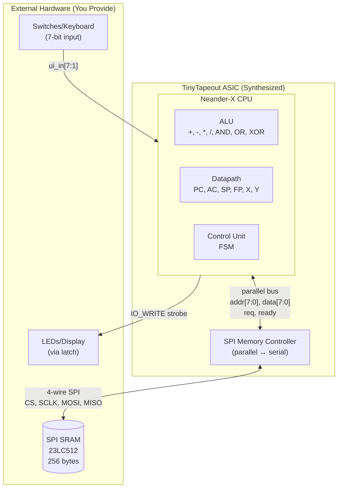
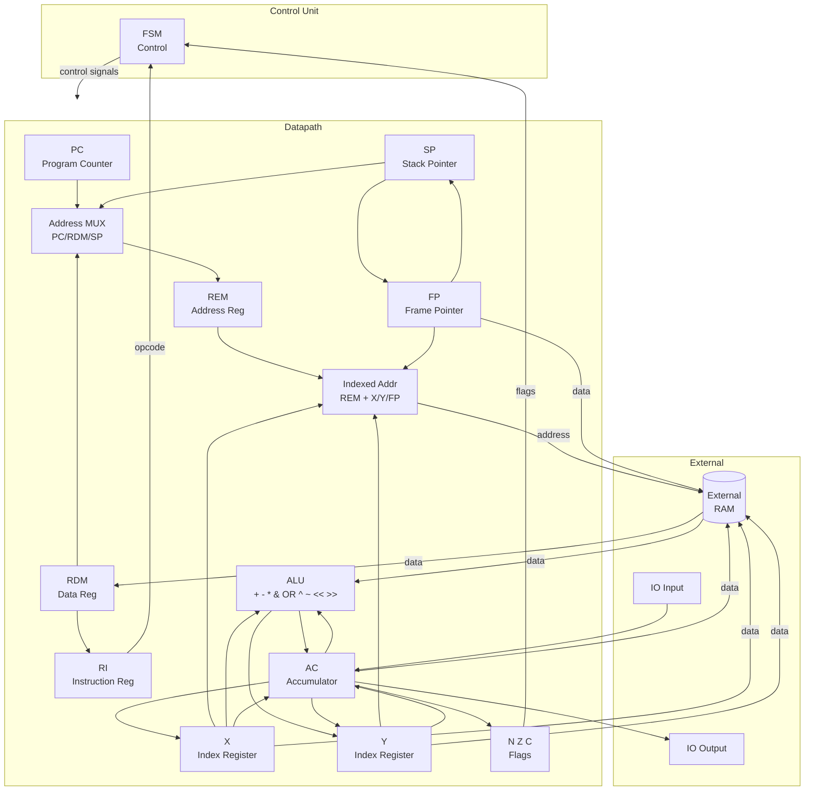

   

# NEANDER-X Processor

A SystemVerilog implementation of the NEANDER-X educational 8-bit processor for the [TinyTapeout](https://tinytapeout.com) VLSI course.

## Overview

NEANDER is a minimal accumulator-based processor developed at [UFRGS](https://www.inf.ufrgs.br/arq/wiki/doku.php?id=neander) (Universidade Federal do Rio Grande do Sul) for teaching fundamental computer architecture concepts in Brazil. This implementation (NEANDER-X) extends the original NEANDER with:

- **I/O Instructions**: IN/OUT for external communication
- **Immediate Addressing**: LDI for loading constants
- **Stack Operations**: PUSH/POP/CALL/RET for subroutines
- **LCC Extension**: SUB, INC, DEC, XOR, SHL, SHR, ASR, NEG, CMP, ADC, SBC for C compiler support
- **X Register**: Index register with LDX, STX, LDXI, TAX, TXA, INX
- **Y Register**: Second index register with LDY, STY, LDYI, TAY, TYA, INY
- **Frame Pointer**: FP register with TSF, TFS, PUSH_FP, POP_FP for stack frame management
- **Indexed Addressing**: LDA/STA with ,X, ,Y, and ,FP modes for array/pointer/local variable access
- **Hardware Multiplication**: MUL instruction (AC * X -> Y:AC) with 16-bit result
- **Hardware Division**: DIV and MOD instructions for integer division and modulo operations

### Key Features

- 8-bit data width and address space
- Single accumulator architecture with X, Y, and FP registers
- Three condition flags (N: Negative, Z: Zero, C: Carry)
- 60+ instructions including:
  - Stack operations (PUSH/POP/CALL/RET)
  - LCC extension (SUB, INC, DEC, XOR, SHL, SHR, ASR, NEG, CMP, ADC, SBC)
  - Carry-based jumps (JC, JNC) for unsigned comparisons
  - Comparison jumps (JLE, JGT, JGE, JBE, JA) for signed/unsigned comparisons
  - X register operations (LDX, STX, LDXI, TAX, TXA, INX)
  - Y register operations (LDY, STY, LDYI, TAY, TYA, INY)
  - Frame pointer operations (TSF, TFS, PUSH_FP, POP_FP)
  - Indexed addressing modes (LDA/STA with ,X, ,Y, and ,FP)
  - Hardware multiplication (MUL: AC * X -> Y:AC, 16-bit result)
  - Hardware division (DIV, MOD: AC / X with quotient and remainder)
  - Multi-byte arithmetic support (ADC, SBC for 16/32-bit operations)
- FSM-based control unit
- SPI memory interface (256 bytes via external SPI SRAM, only 4 pins)

## Instruction Set

### Core Instructions (Original NEANDER)

| Opcode | Mnemonic | Operation | Flags |
|--------|----------|-----------|-------|
| 0x0 | NOP | No operation | - |
| 0x1 | STA addr | MEM[addr] <- AC | - |
| 0x2 | LDA addr | AC <- MEM[addr] | N, Z |
| 0x3 | ADD addr | AC <- AC + MEM[addr] | N, Z |
| 0x4 | OR addr | AC <- AC \| MEM[addr] | N, Z |
| 0x5 | AND addr | AC <- AC & MEM[addr] | N, Z |
| 0x6 | NOT | AC <- ~AC | N, Z |
| 0x8 | JMP addr | PC <- addr | - |
| 0x9 | JN addr | if N: PC <- addr | - |
| 0xA | JZ addr | if Z: PC <- addr | - |
| 0xF | HLT | Halt execution | - |

### Extended Instructions (NEANDER-X)

| Opcode | Mnemonic | Operation | Flags |
|--------|----------|-----------|-------|
| 0xB | JNZ addr | if !Z: PC <- addr | - |
| 0xC | IN port | AC <- IO_IN[port] | N, Z |
| 0xD | OUT port | IO_OUT <- AC | - |
| 0xE | LDI imm | AC <- imm | N, Z |

### Stack Extension

| Opcode | Mnemonic | Operation | Flags |
|--------|----------|-----------|-------|
| 0x70 | PUSH | SP--; MEM[SP] <- AC | - |
| 0x71 | POP | AC <- MEM[SP]; SP++ | N, Z |
| 0x72 | CALL addr | SP--; MEM[SP] <- PC; PC <- addr | - |
| 0x73 | RET | PC <- MEM[SP]; SP++ | - |

### LCC Extension (C Compiler Support)

These instructions extend the ALU capabilities to support C compiler code generation:

| Opcode | Mnemonic | Operation | Flags |
|--------|----------|-----------|-------|
| 0x01 | NEG | AC <- -AC (two's complement) | N, Z, C |
| 0x02 | CMP addr | Compare AC with MEM[addr] (flags only) | N, Z, C |
| 0x74 | SUB addr | AC <- AC - MEM[addr] | N, Z, C |
| 0x75 | INC | AC <- AC + 1 | N, Z |
| 0x76 | DEC | AC <- AC - 1 | N, Z |
| 0x77 | XOR addr | AC <- AC ^ MEM[addr] | N, Z |
| 0x78 | SHL | AC <- AC << 1 | N, Z, C |
| 0x79 | SHR | AC <- AC >> 1 (logical) | N, Z, C |
| 0x61 | ASR | AC <- AC >> 1 (arithmetic, preserves sign) | N, Z, C |
| 0x31 | ADC addr | AC <- AC + MEM[addr] + C (add with carry) | N, Z, C |
| 0x51 | SBC addr | AC <- AC - MEM[addr] - C (subtract with borrow) | N, Z, C |

### Carry-Based Jump Instructions

These instructions enable unsigned comparisons using the carry flag:

| Opcode | Mnemonic | Operation | Flags |
|--------|----------|-----------|-------|
| 0x81 | JC addr | if C: PC <- addr | - |
| 0x82 | JNC addr | if !C: PC <- addr | - |

**Note:** The ADD instruction also updates the carry flag (C) on overflow.

### Comparison Jump Instructions

These instructions are used after CMP to implement signed and unsigned comparisons:

#### Signed Comparisons

| Opcode | Mnemonic | Condition | Description |
|--------|----------|-----------|-------------|
| 0x83 | JLE addr | N=1 OR Z=1 | Jump if Less or Equal |
| 0x84 | JGT addr | N=0 AND Z=0 | Jump if Greater Than |
| 0x85 | JGE addr | N=0 | Jump if Greater or Equal |

#### Unsigned Comparisons

| Opcode | Mnemonic | Condition | Description |
|--------|----------|-----------|-------------|
| 0x86 | JBE addr | C=1 OR Z=1 | Jump if Below or Equal |
| 0x87 | JA addr | C=0 AND Z=0 | Jump if Above |

**Usage:** Execute `CMP addr` first to set flags, then use the appropriate comparison jump.

```assembly
    LDA var_a       ; Load first value
    CMP var_b       ; Compare with second value (sets N, Z, C flags)
    JGT greater     ; Jump if var_a > var_b (signed)
    ; ... else branch ...
greater:
    ; ... greater branch ...
```

### X Register Extension (Indexed Addressing)

The X index register enables efficient array access and pointer operations:

| Opcode | Mnemonic | Operation | Flags |
|--------|----------|-----------|-------|
| 0x7A | LDX addr | X <- MEM[addr] | - |
| 0x7B | STX addr | MEM[addr] <- X | - |
| 0x7C | LDXI imm | X <- imm | - |
| 0x7D | TAX | X <- AC | - |
| 0x7E | TXA | AC <- X | N, Z |
| 0x7F | INX | X <- X + 1 | - |

### Indexed Addressing Modes (X)

| Opcode | Mnemonic | Operation | Flags |
|--------|----------|-----------|-------|
| 0x21 | LDA addr,X | AC <- MEM[addr + X] | N, Z |
| 0x11 | STA addr,X | MEM[addr + X] <- AC | - |

### Y Register Extension

The Y index register provides a second index for dual-pointer operations:

| Opcode | Mnemonic | Operation | Flags |
|--------|----------|-----------|-------|
| 0x03 | TAY | Y <- AC | - |
| 0x04 | TYA | AC <- Y | N, Z |
| 0x05 | INY | Y <- Y + 1 | - |
| 0x06 | LDYI imm | Y <- imm | - |
| 0x07 | LDY addr | Y <- MEM[addr] | - |
| 0x08 | STY addr | MEM[addr] <- Y | - |

### Indexed Addressing Modes (Y)

| Opcode | Mnemonic | Operation | Flags |
|--------|----------|-----------|-------|
| 0x22 | LDA addr,Y | AC <- MEM[addr + Y] | N, Z |
| 0x12 | STA addr,Y | MEM[addr + Y] <- AC | - |

### Frame Pointer Extension

The Frame Pointer (FP) register enables efficient access to local variables and parameters in stack frames, essential for C compiler support:

| Opcode | Mnemonic | Operation | Flags |
|--------|----------|-----------|-------|
| 0x0A | TSF | FP <- SP (Transfer SP to FP) | - |
| 0x0B | TFS | SP <- FP (Transfer FP to SP) | - |
| 0x0C | PUSH_FP | SP--; MEM[SP] <- FP | - |
| 0x0D | POP_FP | FP <- MEM[SP]; SP++ | - |

### Indexed Addressing Modes (FP)

| Opcode | Mnemonic | Operation | Flags |
|--------|----------|-----------|-------|
| 0x24 | LDA addr,FP | AC <- MEM[addr + FP] | N, Z |
| 0x14 | STA addr,FP | MEM[addr + FP] <- AC | - |

**Typical function prologue/epilogue pattern:**

```assembly
; Function prologue
func:   PUSH_FP         ; Save caller's FP
        TSF             ; FP = SP (set up new frame)

        ; Access local variables via FP-indexed addressing
        LDA 0x01,FP     ; Load first local (at FP+1)
        STA 0x02,FP     ; Store to second local (at FP+2)

; Function epilogue
        TFS             ; SP = FP (deallocate locals)
        POP_FP          ; Restore caller's FP
        RET             ; Return to caller
```

### Hardware Multiplication and Division

| Opcode | Mnemonic | Operation | Flags |
|--------|----------|-----------|-------|
| 0x09 | MUL | Y:AC <- AC * X (16-bit result) | N, Z, C |
| 0x0E | DIV | AC <- AC / X (quotient), Y <- remainder | N, Z, C |
| 0x0F | MOD | AC <- AC % X (remainder), Y <- quotient | N, Z, C |

**MUL**: Multiplies AC by X using a combinational 8x8 multiplier. The 16-bit result is stored with the high byte in Y and the low byte in AC. The carry flag is set if the result overflows 8 bits (high byte != 0).

**DIV**: Divides AC by X. The quotient is stored in AC and the remainder in Y. On division by zero, the carry flag is set as an error indicator, AC is set to 0xFF, and Y preserves the original dividend.

**MOD**: Computes AC modulo X. The remainder is stored in AC and the quotient in Y. On division by zero, the carry flag is set as an error indicator, AC preserves the original dividend, and Y is set to 0xFF.

```assembly
; Example: Compute 17 / 5 = 3 remainder 2
    LDI 17          ; AC = 17
    LDXI 5          ; X = 5
    DIV             ; AC = 3 (quotient), Y = 2 (remainder)

; Example: Compute 17 % 5 = 2
    LDI 17          ; AC = 17
    LDXI 5          ; X = 5
    MOD             ; AC = 2 (remainder), Y = 3 (quotient)
```

### Multi-Byte Arithmetic (ADC/SBC)

**ADC** (Add with Carry) and **SBC** (Subtract with Borrow) enable 16-bit and 32-bit arithmetic operations by propagating the carry flag between byte operations.

```assembly
; Example: 16-bit addition (0x0102 + 0x00FF = 0x0201)
; Operand A: low=0x02 at [A_LO], high=0x01 at [A_HI]
; Operand B: low=0xFF at [B_LO], high=0x00 at [B_HI]
; Result:    low at [R_LO], high at [R_HI]

    LDA A_LO        ; Load low byte of A
    ADD B_LO        ; Add low byte of B (sets carry on overflow)
    STA R_LO        ; Store low byte result
    LDA A_HI        ; Load high byte of A
    ADC B_HI        ; Add high byte of B + carry
    STA R_HI        ; Store high byte result
    ; Result: R = 0x0201

; Example: 16-bit subtraction (0x0200 - 0x0001 = 0x01FF)
    LDI 0           ; Clear AC
    ADD zero        ; Clear carry flag (ADD 0 clears C)
    LDA A_LO        ; Load low byte of A (0x00)
    SBC B_LO        ; Subtract low byte of B (0x01), sets borrow
    STA R_LO        ; Store low byte (0xFF)
    LDA A_HI        ; Load high byte of A (0x02)
    SBC B_HI        ; Subtract high byte (0x00) - borrow
    STA R_HI        ; Store high byte (0x01)
    ; Result: R = 0x01FF
```

**ASR** (Arithmetic Shift Right) preserves the sign bit, essential for signed division by powers of 2:

```assembly
; Example: Signed division by 2
    LDI 0xF8        ; AC = -8 (signed)
    ASR             ; AC = 0xFC = -4 (sign preserved)

; Compare with logical shift (SHR):
    LDI 0xF8        ; AC = -8 (signed) = 248 (unsigned)
    SHR             ; AC = 0x7C = 124 (sign NOT preserved)
```

## System Architecture

The design is split between **synthesized logic** (on the TinyTapeout ASIC) and **external hardware** (SPI SRAM chip you provide).



### What Gets Synthesized?

| Component | File | Synthesized? | Description |
|-----------|------|--------------|-------------|
| ALU | `neander_x_alu.sv` | Yes | Arithmetic/logic operations |
| Datapath | `neander_x_datapath.sv` | Yes | Registers (PC, AC, SP, X, Y, FP) |
| Control Unit | `neander_x_control_unit.sv` | Yes | FSM with ~90 states |
| CPU Top | `top_cpu_neander_x.sv` | Yes | CPU integration |
| SPI Controller | `spi_memory_controller.sv` | Yes | Parallel-to-SPI bridge |
| TT Wrapper | `project.sv` | Yes | TinyTapeout pin mapping |
| SPI SRAM Model | `spi_sram_model.sv` | **No** | Simulation only |

The **SPI Memory Controller** converts parallel CPU memory requests into serial SPI transactions. The actual **RAM is external** - you connect a physical SPI SRAM chip (like 23LC512) to the TinyTapeout pins. The `spi_sram_model.sv` file is only used during simulation to emulate that external chip.

## CPU Internal Architecture



### Module Hierarchy

```
tt_um_cpu_leonardoaraujosantos (TinyTapeout wrapper - project.sv)
├── cpu_top (top_cpu_neander_x.sv)
│   ├── neander_datapath (neander_x_datapath.sv)
│   │   ├── pc_reg (Program Counter, 8-bit)
│   │   ├── sp_reg (Stack Pointer, 8-bit)
│   │   ├── fp_reg (Frame Pointer, 8-bit)
│   │   ├── x_reg (X Index Register)
│   │   ├── y_reg (Y Index Register)
│   │   ├── mux_addr (3-way Address MUX)
│   │   ├── generic_reg (REM, RDM, RI, AC)
│   │   ├── neander_alu (ADD, ADC, SUB, SBC, MUL, DIV, MOD, AND, OR, XOR, NOT, SHL, SHR, ASR, NEG)
│   │   └── nzc_reg (N, Z, C Flags)
│   └── neander_control (neander_x_control_unit.sv - FSM ~90 states)
│
└── spi_memory_controller (spi_memory_controller.sv)
    ├── SPI Master interface (directly to external SRAM)
    ├── 8-state FSM (IDLE → CMD → ADDR_HI → ADDR_LO → DATA → DONE)
    └── ~70 CPU cycles per memory access
```

## Pin Connections

The NEANDER-X processor uses an **SPI memory interface** to connect to external SPI SRAM, requiring only 4 pins for memory access (vs 15 pins for parallel RAM). This enables a 256-byte address space while freeing pins for debug outputs.

### Pin Map

#### Dedicated Outputs (`uo_out`)

| Pin | Signal | Description |
|-----|--------|-------------|
| uo_out[0] | SPI_CS_N | SPI Chip Select (active low) |
| uo_out[1] | SPI_SCLK | SPI Serial Clock |
| uo_out[2] | SPI_MOSI | SPI Master Out Slave In (data to SRAM) |
| uo_out[3:6] | DBG_AC[3:0] | Debug: Accumulator bits 0-3 |
| uo_out[7] | IO_WRITE | I/O Write strobe for output latch |

#### Bidirectional I/O (`uio`)

| Pin | Signal | Description |
|-----|--------|-------------|
| uio[7:0] | DBG_PC | Debug: Program Counter (8-bit) |

- **Direction**: All outputs (`uio_oe` = 0xFF)
- Used for debugging/monitoring PC during execution

#### Dedicated Inputs (`ui_in`)

| Pin | Signal | Description |
|-----|--------|-------------|
| ui_in[0] | SPI_MISO | SPI Master In Slave Out (data from SRAM) |
| ui_in[7:1] | IO_IN[7:1] | 7-bit input port for IN instruction |

### Connection Diagram

```
                    TinyTapeout Chip                        SPI SRAM (23LC512)
                   ┌─────────────────┐                      ┌─────────────────┐
                   │   NEANDER-X     │                      │                 │
    Switches ────► │ ui_in[7:1]      │                      │     CS (pin 1)◄─┼── uo_out[0]
    (7-bit)        │                 │                      │                 │
                   │                 │                      │    SCK (pin 6)◄─┼── uo_out[1]
                   │ uo_out[0] ──────┼──────────────────────┼─►               │
                   │    (SPI_CS_N)   │                      │     SI (pin 5)◄─┼── uo_out[2]
                   │ uo_out[1] ──────┼──────────────────────┼─►               │
                   │    (SPI_SCLK)   │                      │     SO (pin 2)──┼─► ui_in[0]
                   │ uo_out[2] ──────┼──────────────────────┼─►               │
                   │    (SPI_MOSI)   │                      │    VCC (pin 8)──┼── 3.3V
                   │                 │                      │    VSS (pin 4)──┼── GND
                   │ ui_in[0] ◄──────┼──────────────────────┼──               │
                   │    (SPI_MISO)   │                      │   HOLD (pin 7)──┼── 3.3V
                   │                 │                      └─────────────────┘
                   │ uio[7:0] ───────┼─► Debug (PC value)
                   │                 │
                   │ uo_out[7] ──────┼─► Output Latch (optional)
                   │    (IO_WRITE)   │
                   └─────────────────┘
```

### SPI Memory Interface

The CPU communicates with external SPI SRAM using a 4-wire interface:

| Signal | Direction | Description |
|--------|-----------|-------------|
| SPI_CS_N | Output | Chip select, active LOW during transactions |
| SPI_SCLK | Output | Serial clock (CPU_CLK / 2) |
| SPI_MOSI | Output | Data from CPU to SRAM |
| SPI_MISO | Input | Data from SRAM to CPU |

**Protocol:** Standard SPI Mode 0 (CPOL=0, CPHA=0)
- READ command: 0x03
- WRITE command: 0x02
- Each memory access takes ~70 CPU cycles

For detailed protocol information, see [SPI SRAM Memory](docs/SPI_SRAM_MEMORY.md).

### I/O Interface

**Input (IN instruction):**
- Connect switches or keyboard to `ui_in[7:1]` (7 bits available)
- Note: `ui_in[0]` is reserved for SPI_MISO
- The IN instruction reads this port directly into AC

**Output (OUT instruction):**
- When executing OUT, the CPU pulses `uo_out[7]` (IO_WRITE) high
- Connect an external latch (e.g., 74HC574) to capture AC value
- AC bits [3:0] are also visible on `uo_out[6:3]` for debugging

### Recommended External Components

| Component | Purpose | Example Parts |
|-----------|---------|---------------|
| SPI SRAM | Program and data storage (256 bytes) | **23LC512**, 23K256, 23LC1024 |
| 8-bit Latch | Capture I/O output | 74HC574, 74HC374 |
| DIP Switches | Input port (7-bit) | 8-position DIP (bit 0 unused) |
| LED Array | Display output | 8x LEDs with resistors |

### Pin Savings: SPI vs Parallel

| Interface | Memory Pins | Address Space | Debug Pins Available |
|-----------|-------------|---------------|---------------------|
| Parallel (old) | 15 pins | 32 bytes | 0 |
| **SPI (current)** | **4 pins** | **256 bytes** | **12 pins** |

The SPI interface saves 11 pins while providing 8x more memory!

## Documentation

- [Project Info (TinyTapeout)](docs/info.md) - Pin interface and testing guide
- [NEANDER CPU Guide](docs/NEANDER_cpu.md) - Complete architecture and implementation details
- [Stack Extension](docs/NEANDER_X_STACK.md) - PUSH/POP/CALL/RET documentation
- [SPI SRAM Memory](docs/SPI_SRAM_MEMORY.md) - External SPI SRAM protocol and compatible chips
- [SPI Memory Controller](docs/SPI_MEM_CONTROLLER.md) - SPI controller implementation details
- [LCC Compiler Backend](docs/LCC_NEANDER_BACKEND.md) - Guide for targeting LCC C compiler to NEANDER-X
- [LCC Compiler Reference](docs/LCC_COMPILER_COMPLETE.md) - Complete LCC retargeting guide (Portuguese)
- [GitHub Actions](docs/GITHUB_ACTIONS.md) - CI/CD workflow explanation

## Quick Start

### Running Tests

```bash
# Run TinyTapeout cocotb tests
cd test
make

# Run comprehensive cocotb tests
cd cocotb_tests
make
```

### Example Program

A simple program that calculates 5 + 3 and outputs the result:

```
Address  Code   Instruction
0x00     0xE0   LDI 5         ; AC = 5
0x01     0x05
0x02     0x30   ADD [0x10]    ; AC = AC + MEM[0x10]
0x03     0x10
0x04     0xD0   OUT 0         ; Output AC
0x05     0x00
0x06     0xF0   HLT           ; Halt
...
0x10     0x03   ; Data: 3
```

Result: Output = 8

## TinyTapeout Build Configuration

### Tile Size

The design size is configured in `info.yaml`. A single tile is approximately 167x108 um.

```yaml
# info.yaml
tiles: "1x1"    # Valid values: 1x1, 1x2, 2x2, 3x2, 4x2, 6x2, 8x2
```

| Tile Size | Area (um²) | Use Case |
|-----------|------------|----------|
| 1x1 | ~18,000 | Small designs (<60% utilization) |
| 1x2 | ~36,000 | Medium designs with combinational logic |
| 2x2 | ~72,000 | Large designs with multiple features |

**Current design**: With the hardware multiplier (MUL), the design uses ~64% of a 1x1 tile. If you add more features (like DIV), consider upgrading to 1x2.

### Placement Density

The placement density controls how tightly cells are packed during the place-and-route flow. This is configured in `src/config.json`:

```json
{
  "PL_TARGET_DENSITY_PCT": 66
}
```

| Density | Description |
|---------|-------------|
| 50-60% | Conservative, easy routing, recommended for complex designs |
| 60-70% | Moderate, good balance between area and routability |
| 70-80% | Aggressive, may cause routing congestion or timing issues |

**Common errors:**

| Error | Cause | Solution |
|-------|-------|----------|
| GPL-0302 | Design utilization > target density | Increase `PL_TARGET_DENSITY_PCT` or use larger tile |
| DPL-0036 | No room for timing buffers after placement | Decrease density or use larger tile |

**Note**: The actual utilization includes timing repair buffers (~5-10% extra). If your design is at 64% and density is 66%, timing repair may push it over the limit.

### Running Hardening Locally

To run the GDS hardening flow locally (requires LibreLane and PDK installed):

```bash
# From project root
cd /path/to/neander_tinytapeout_2026

# Run hardening with LibreLane
librelane harden

# Or specify the PDK explicitly
librelane harden --pdk ihp-sg13g2
```

**Using Docker** (recommended, no local PDK installation needed):

```bash
# From project root
docker run --rm -v $(pwd):/work -w /work \
  ghcr.io/tinytapeout/tt-gds-action:ttihp26a \
  librelane harden
```

**Output files** are generated in `runs/wokwi/` directory:
- `*.gds` - Final GDSII layout
- `*.lef` - Library Exchange Format
- `*-signoff/` - Timing and DRC reports

### Configuration Reference

Key parameters in `src/config.json`:

| Parameter | Default | Description |
|-----------|---------|-------------|
| `PL_TARGET_DENSITY_PCT` | 60 | Target placement density (50-80) |
| `CLOCK_PERIOD` | 20 | Clock period in ns (20ns = 50MHz) |
| `PL_RESIZER_HOLD_SLACK_MARGIN` | 0.1 | Hold timing margin |
| `GRT_RESIZER_HOLD_SLACK_MARGIN` | 0.05 | Global route hold margin |

For more details, see the [LibreLane Configuration Documentation](https://librelane.readthedocs.io/en/latest/reference/configuration.html).

## What is Tiny Tapeout?

Tiny Tapeout is an educational project that aims to make it easier and cheaper than ever to get your digital and analog designs manufactured on a real chip.

To learn more and get started, visit <https://tinytapeout.com>.

## Set up your Verilog project

1. Add your Verilog files to the `src` folder.
2. Edit the [info.yaml](info.yaml) and update information about your project, paying special attention to the `source_files` and `top_module` properties. If you are upgrading an existing Tiny Tapeout project, check out our [online info.yaml migration tool](https://tinytapeout.github.io/tt-yaml-upgrade-tool/).
3. Edit [docs/info.md](docs/info.md) and add a description of your project.
4. Adapt the testbench to your design. See [test/README.md](test/README.md) for more information.

The GitHub action will automatically build the ASIC files using [LibreLane](https://www.zerotoasiccourse.com/terminology/librelane/).

## Enable GitHub actions to build the results page

- [Enabling GitHub Pages](https://tinytapeout.com/faq/#my-github-action-is-failing-on-the-pages-part)

## Resources

- [FAQ](https://tinytapeout.com/faq/)
- [Digital design lessons](https://tinytapeout.com/digital_design/)
- [Learn how semiconductors work](https://tinytapeout.com/siliwiz/)
- [Join the community](https://tinytapeout.com/discord)
- [Build your design locally](https://www.tinytapeout.com/guides/local-hardening/)

## What next?

- [Submit your design to the next shuttle](https://app.tinytapeout.com/).
- Edit [this README](README.md) and explain your design, how it works, and how to test it.
- Share your project on your social network of choice:
  - LinkedIn [#tinytapeout](https://www.linkedin.com/search/results/content/?keywords=%23tinytapeout) [@TinyTapeout](https://www.linkedin.com/company/100708654/)
  - Mastodon [#tinytapeout](https://chaos.social/tags/tinytapeout) [@matthewvenn](https://chaos.social/@matthewvenn)
  - X (formerly Twitter) [#tinytapeout](https://twitter.com/hashtag/tinytapeout) [@tinytapeout](https://twitter.com/tinytapeout)
  - Bluesky [@tinytapeout.com](https://bsky.app/profile/tinytapeout.com)
